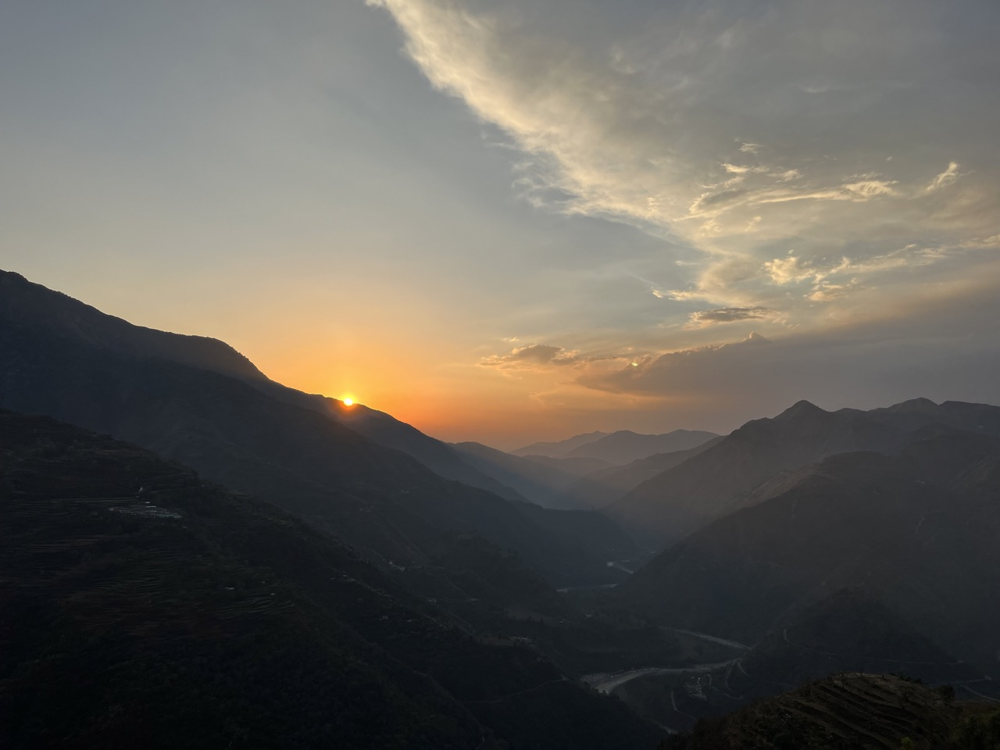

# What I'm doing now

Updated - April 17, 2023 from Pune, India

## Trip to Musoorie

A few weeks ago I returned from a long trip in Mussoorie.

## This website

I have setup a basic website with <a href="https://nownownow.com/about" target="_blank">a 'now' page</a> (this page). For a quick and easy solution, I built it with 11ty, Water.css & hosted it on Github Pages.

I read about the <a href="https://sive.rs/now" target="_blank">now</a> page on Derek Sivers website a long time ago, and recently came across <a href="https://moinaabdul.com/" target="_blank">Moina Abdul's</a> website and her now page. This inspired me to set this up.

## Music and Reading

I have always wanted to learn a musical instrument, for the past month I have been learning to play the Ukelele. My goal for the next 2 months is to learn to play a couple of songs and be able to sing while strumming.

I recently finished reading **Make Time**, which made me understand among other things, the importance of using and maintaining a Calendar, which I haven't started doing anyway😅.

Finished **Station Eleven** by Emily St. John Mandel. Send me your book recommendations.

## Tech and Career

On the career front, I was working as a DevOps Consultant for a startup. Right now, I am learning more about containerization & go. Starting work on a few freelance projects soon.

If you are looking for some help with DevOps practises for your org or team, feel free to reach out to me(email and socials in the footer)
